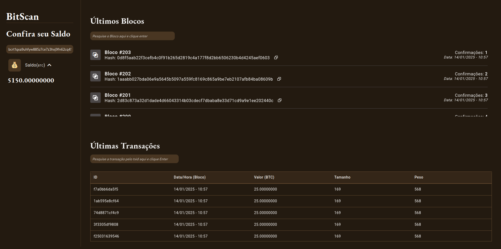

# Block Explorer UI

> Initial Interface



## Built With 🔨
- **React (vite)** 
- **TS** 
- **Boxicons**

## Instructions to Run Locally

### Prerequisites:

You need to have **Node.js** installed to run the project locally. 

#### Step 1
In the terminal, clone the project:
```
git clone https://github.com/dev-araujo/dojo-bitcoin.git
```

#### Step 2

In a new terminal, navigate to the `frontend` folder and install the dependencies:

```
cd frontend
npm install
```

#### Step 3
Start the React application:

```
npm run dev
```

The application will be available at **`http://localhost:5173`**. 🎉✨🥳

## Instructions to Run with Docker

In a new terminal, navigate to the `frontend` folder and install the dependencies:

#### Step 1
```
cd frontend
npm install
```

#### Step 2
Create an image using the following command:

```
docker build -t dojo-bitcoin-app .
```

#### Step 3
Start the container:

```
docker run -d -p 8080:80 --name dojo-bitcoin-container dojo-bitcoin-app
```

The application will be available at **`http://localhost:8080`**. 🎉✨🥳