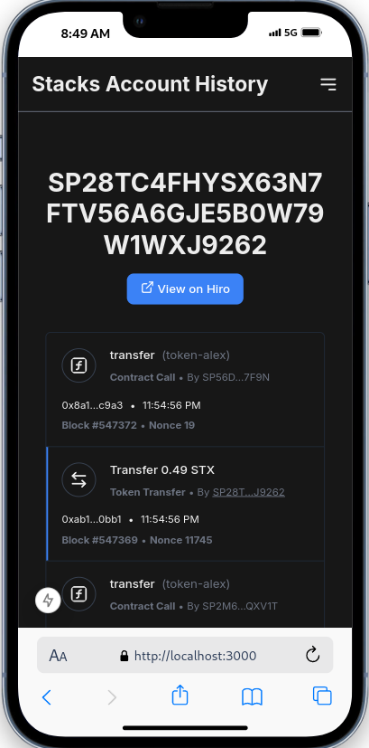
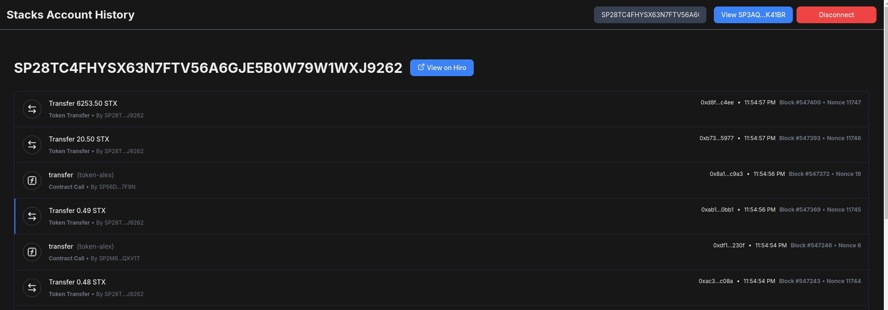

# Mini Explorador de Blocos Stacks
  

> https://stacks-account-history-rose.vercel.app/

Este projeto é um mini explorador de blocos construído usando a stack de tecnologia [Stacks](https://www.stacks.co/) uma blockchain de segunda camada em cima do BTC 😲. Ele permite que os usuários visualizem o histórico de transações de uma conta Stacks.

## Sobre

Este projeto é baseado no tutorial Construindo um Mini Explorador de Blocos do [currículo da Graduação de Desenvolvedor Stacks da DAO LearnWeb3](https://learnweb3.io/degrees/stacks-developer-degree/build-full-stack-apps-on-stacks/building-a-mini-block-explorer/). 

O projeto permite ao usuário: 

-   Conectar suas carteiras Stacks (por exemplo, **Leather** ou **Xverse**)
-   Visualizar o histórico de transações de sua própria conta
-   Pesquisar o histórico de transações de qualquer endereço Stacks válido
-   Carregar mais transações em um formato paginado

## Resultado  ✨



<details>
<summary> <h2>Versão Desktop</h2></summary>



</details>


## Feito com 🔨

- Next.js
- [@stacks/connect](https://www.npmjs.com/package/@stacks/connect)
- [@stacks/transactions](https://www.npmjs.com/package/@stacks/transactions)
- [Hiro](https://docs.hiro.so/stacks/api)


## Rodando local

### Pré-requisitos

-   Node.js (v16 ou posterior)
-   npm (v8 ou posterior)
-   Uma carteira Stacks (por exemplo, Leather, Xverse)
-   Familiaridade com React, Next.js e TypeScript

### Passo à Passo

1.  Clone este repositório:

```bash
git clone https://github.com/dev-araujo/account-history_Stacks.git
```


2.  Instale as dependências:


```bash
npm install
```


3.  Inicie o servidor de desenvolvimento:


```bash
npm run dev
```

Abra seu navegador e visite `http://localhost:3000` ✨✨

## Uso

1.  **Conectando sua Carteira:** Clique no botão "Conectar Carteira" e escolha sua carteira Stacks. Siga as instruções na carteira para conectar sua conta.
2.  **Visualizando seu Histórico de Transações:** Depois que sua carteira estiver conectada, o aplicativo será redirecionado automaticamente para uma página que exibe o histórico de transações da sua conta.
3.  **Pesquisando por um Endereço:** Na barra de navegação, insira um endereço Stacks válido no campo de pesquisa e pressione Enter. O aplicativo exibirá o histórico de transações para o endereço especificado.
4.  **Carregando Mais Transações:** Clique no botão "Carregar Mais" na parte inferior da lista de transações para carregar mais transações em incrementos de 20.


## Reconhecimentos

  - [Graduação Desenvolvedor Stacks da DAO LearnWeb3 ](https://learnweb3.io/degrees/stacks-developer-degree/build-full-stack-apps-on-stacks/building-a-mini-block-explorer/)
  - [Hiro](https://docs.hiro.so/stacks/api)
  - [Stacks.js](https://www.stacks.co/)

---

#### Autor 👷


[Adriano P Araujo](https://www.linkedin.com/in/araujocode/)

